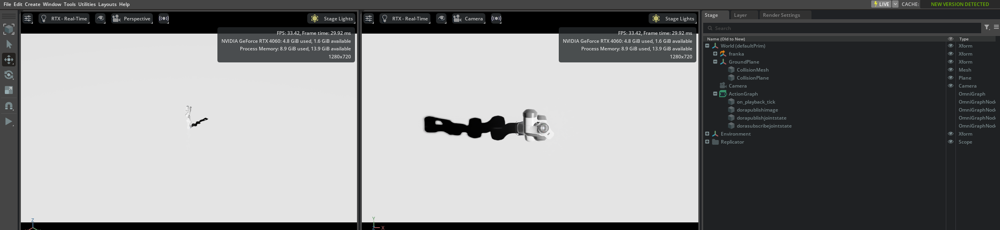
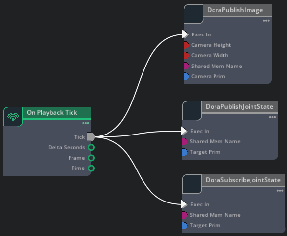

# isaacsim.dora.bridge

This is an isaacsim.dora.bridge extension for communication between isaacsim and Dora. 

**! unstable**

## Architecture

## Getting Started

1. Clone this repo to a dir.
2. Add extension search path `<path of the dir above>/exts` in isaacsim (Window > $\equiv$ > Settings > Extension Search Paths).
3. Now you can search isaacsim.dora.bridge extension in the search bar and enable it.

**NOTE**: Recommend to move isaacsim.dora.bridge/ in exts/ to `<path_of_isaacsim>/extsUser/`.

### DoraPublishImage

This node is used to publish Image from isaacsim to Dora.

4. Add an OnPlaybackTick node and an DoraPublishImage node (category: Extension) in an Action graph.
5. Connect the output Tick of OnPlayBackTick with the input Exec In of DoraPublishImage.

6. Select the camera prim (, camera width, camera height, node id and output id) in DoraPublishImage node.
7. Execute `dora build dataflow.yml` and `dora run dataflow.yml` in dora_sample/DoraPublishImage.
8. Click PLAY.
9. Whenever you want to stop publish, just click STOP.

**NOTE**: 
+ Only support RGB image currently. 
+ Isaacsim try to make its best to publish image, so if you want to accept image at a certain frame rate, just set a frequency to be received on the Dora side.

### DoraPublishJointState

This node is used to publish Joint State from isaacsim to Dora.

4. Add an OnPlaybackTick node and an DoraPublishJointState node (category: Extension) in an Action graph.
5. Connect the output Tick of OnPlayBackTick with the input Exec In of DoraPublishJointState.

6. Select the joint prim (and sharedMemName) in DoraPublishJointState node.
7. Execute `dora build dataflow.yml` and `dora run dataflow.yml` in dora_sample/DoraPublishJointState.
8. Click PLAY.
9. Whenever you want to stop publish, just click STOP.

**NOTE**: Publish joint state as a one-dimensional list whose length is the sum of dof and gripper.

### DoraSubscribeJointState

This node is used to subscribe Joint State from Dora to isaacsim.

4. Add an OnPlaybackTick node and an DoraSubscribeJointState node (category: Extension) in an Action graph.
5. Connect the output Tick of OnPlayBackTick with the input Exec In of DoraSubscribeJointState.

6. Select the joint prim (and sharedMemName) in DoraSubscribeJointState node.
7. Execute `dora build dataflow.yml` and `dora run dataflow.yml` in dora_sample/DoraSubscribeJointState.
8. Click PLAY.
9. Whenever you want to stop subscription, just click STOP.

**NOTE**: 
+ Subscribe a one-dimensional list, make sure the list meets the requirements of the target prim.
+ This node execute the pose command automatically after the subscription, so it has no outputs and you don't need to add a Articulation Controller node.

## Examples

In examples/franka/, we have a robot env (franka.usd), open it with isaacsim, the world perspective and the camera perspective are as follows.

The action graph is as follows.

Execute `dora build dataflow.yml` and `dora run dataflow.yml` in examples/ first and then click PLAY.

**NOTE**: There may be some errors, but you can neglect them.

You can see the arm move randomly and a openCV plot displays the camera feed in real-time.

In the end, just click STOP, press 'q' to stop plot and 'ctrl+c' to stop Dora.
