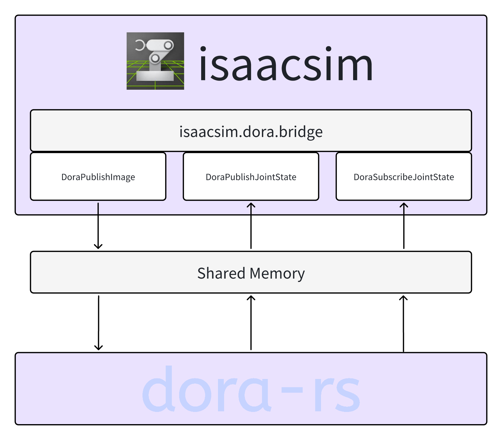
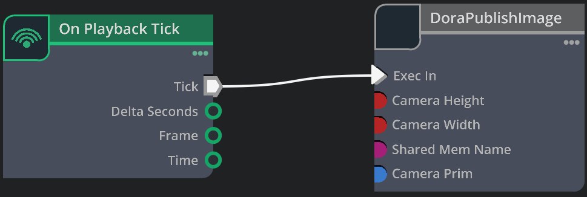
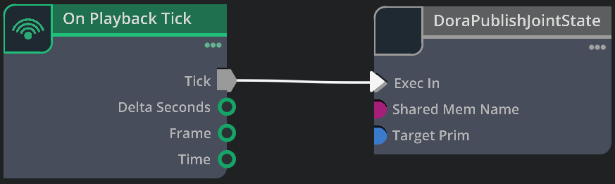
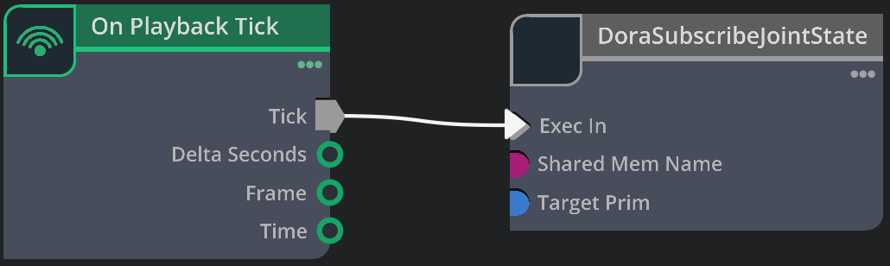

# isaacsim.dora.bridge

This is an isaacsim.dora.bridge extension for communication between isaacsim and Dora. 

## Architecture

## Getting Started

1. Clone this repo to a dir.
2. Add extension search path `<path of the dir above>/exts` in isaacsim (Window > $\equiv$ > Settings > Extension Search Paths).
3. Now you can search isaacsim.dora.bridge extension in the search bar and enable it.

NOTE: recommend to move isaacsim.dora.bridge/ in exts/ to `<path_of_isaacsim>/extsUser/`

**ATTENTION: All of the following should start the publisher before the subscriber.**

### DoraPublishImage

This node is used to publish Image from isaacsim to Dora.

4. Add an OnPlaybackTick node and an DoraPublishImage node (category: Extension) in an Action graph.
5. Connect the output Tick of OnPlayBackTick with the input Exec In of DoraPublishImage.

6. Select the camera prim (, camera width, camera height and sharedMemName) in DoraPublishImage node.
7. Click PLAY.
8. Execute `dora build dataflow.yml` and `dora run dataflow.yml` in dora_sample/DoraPublishImage.
9. Whenever you want to stop publish, just click STOP.

### DoraPublishJointState

This node is used to publish Joint State from isaacsim to Dora.

4. Add an OnPlaybackTick node and an DoraPublishJointState node (category: Extension) in an Action graph.
5. Connect the output Tick of OnPlayBackTick with the input Exec In of DoraPublishJointState.

6. Select the joint prim (and sharedMemName) in DoraPublishJointState node.
7. Click PLAY.
8. Execute `dora build dataflow.yml` and `dora run dataflow.yml` in dora_sample/DoraPublishJointState.
9. Whenever you want to stop publish, just click STOP.

### DoraSubscribeJointState

This node is used to subscribe Joint State from Dora to isaacsim.

4. Add an OnPlaybackTick node and an DoraSubscribeJointState node (category: Extension) in an Action graph.
5. Connect the output Tick of OnPlayBackTick with the input Exec In of DoraSubscribeJointState.

6. Select the joint prim (and sharedMemName) in DoraSubscribeJointState node.
7. Execute `dora build dataflow.yml` and `dora run dataflow.yml` in dora_sample/DoraSubscribeJointState.
8. Click PLAY.
9. Whenever you want to stop subscribe, just click STOP.
