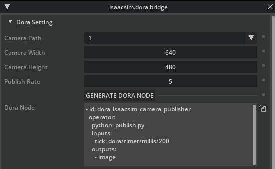

# isaacsim.dora.bridge

This is a isaacsim.dora.bridge extension for communication between isaacsim and dora. 

## get-start

1. Clone this repository to a folder.
2. Add extension search path (the folder above) in isaacsim (Window > $\equiv$ > Settings > Extension Search Paths).
3. Now you can search isaacsim.dora.bridge extension in search bar and enable it.

Then you can see the gui of the extension.

1. Set the Camera Path, Width, Height and Publish Rate and click **GENERATE DORA NODE**.
2. You can get the code of dora node, copy them and paste to the yaml file.

